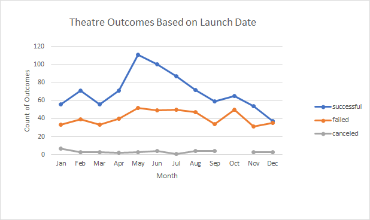
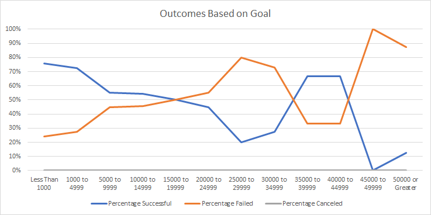

# Kickstarting with Excel  - Module 1 Challenge

## Overview of Project
### Purpose

The purpose of this project is to analyze comparisons of Kickstarter launch data and funding goals. This data will focus on the fields of theatre and plays using Excel formulas and pivot tables.

## Analysis and Challenges
### Analysis of Outcomes Based on Launch Date

This analysis was performed to compare the effect of launch date of theatre-based Kickstarter campaigns. To preform this analysis a pivot table was created using the data provided by the client to compare the total count of successful, failed and cancelled Kickstarter projects, divided by month in a line plot. 

As a part of this analysis, conversions to the data provided were performed to establish the date of the projects and the year converted from unix time in excel, as shown.

```
Date in Excel Format = ((( UnixTime /60)/60)/24)+DATE(1970,1,1)
Year = Year(Date in Excel Format)
```

The following figure was produced as a result of the analysis.



### Analysis of Outcomes Based on Goals

This analysis was performed to analyze the impact of the set initial goal in dollars of a Kickstarter project for a play by percent. For the analysis, the COUNTIFS formula in excel was used to filter the projects into bins reflective of the size of each goal and how many Kickstarters were successful, failed or cancelled in each range. The general formula used is as shown.

```
=COUNTIFS(Kickstarter!$R:$R,"plays",Kickstarter!$F:$F,D$1,Kickstarter!$D:$D,CONCAT(">=",$B3),Kickstarter!$D:$D,CONCAT("<",$C3))
```

The formula below is the same with ranges changed to plain text based on the columns and data used in the cells.

```
=COUNTIFS( Subcategory Column,"plays", Kickstarter Outcomes , [successful, canceled, failed], Goal column, comparison to lower value, Goal column, comparison to higher value)
```

The following figure was produced as a result of the analysis.


### Challenges and Difficulties Encountered

Some of the challenges encountered were dealing with the date conversions. Learning how unix time worked and how to convert it into a format Excel could use was an important step and vital to the future analyses. A formula was needed to convert the data and to correctly interpret all the results.

Another difficulty was using the COUNTIFS formula in Excel. The multiple arguments and ranges involved to filter the information in many ways made the formula in excel extremely long, and made it difficult to find errors made when creating the formula and making sure it works correctly.

## Results

- What are two conclusions you can draw about the Outcomes based on Launch Date?

Based on the figure created comparing theatre outcomes and the month a project launch indicated that May was the most popular month to launch a Kickstarter. More then that, it was also the most successful month to launch, with the highest amount of recorded successful outcomes.

October and May also had a high amount of failed Kickstarter campaigns, but October had less projects overall. December may be the riskiest month to launch, having an equal amount of successes and failures.

- What can you conclude about the Outcomes based on Goals?

Based on the outcomes of play Kickstarters based on goals, smaller projects on average had a higher chance of being successful. Plays in the $45000-49999 range had a 100% success rate.

- What are some limitations of this dataset?

One of the limitations of the data set is the range of values. In particular, the Outcomes Based on Goal table has a lot fewer plays populating the higher dollar amounts, leading to the line plot tending to change every bin and making it very dependant on a few Kickstarters.

This data is also specific to Kickstarter, so there is a chance there may be other methods more popular or effective for theatre and play projects to crowdfun while this dataset is limited to only Kickstarter data.

- What are some other possible tables and/or graphs that we could create?

One table that can be created is looking at higher value kickstarters with less specific filters on category and subcategory. With the extra data points, it may be able to capture more accurate trends on the success rates of projects with higher goals.

Another table we could create is factoring in the country of origin into the analyses. If a play or theatre project tends to be more successful in other countries, it may indicate a better place to launch a campaign, or even where a client might direct advertising or translation efforts.